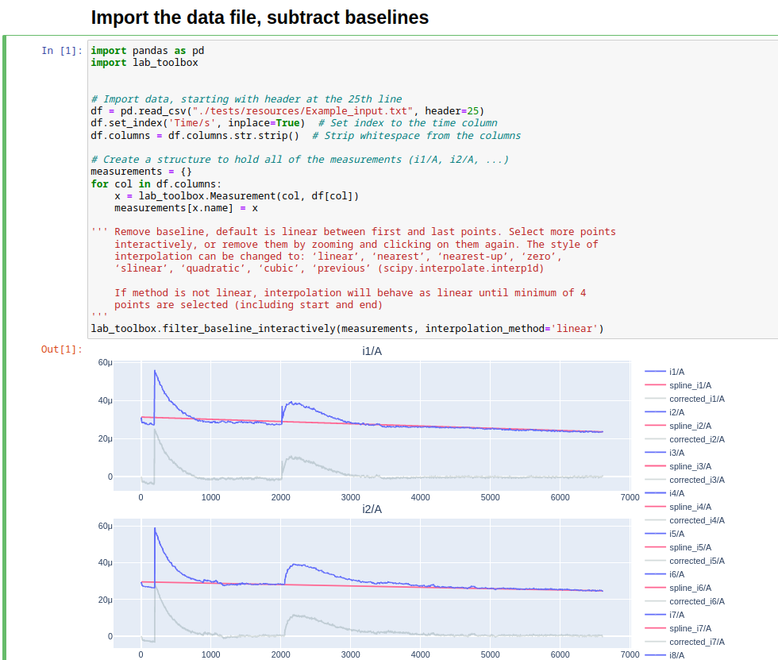
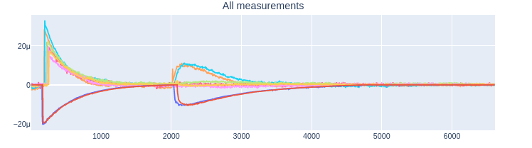
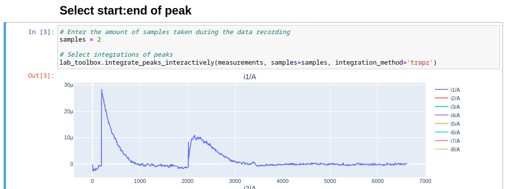

# lab-codes

# InstrumentProcessing

This notebook processes the input data collected from an electrochemical
probe. The workflow is the same as the original MATLAB code kept in the first
commit to this repository.

## Getting started

1. You will need to clone this repository to obtain the notebook and library
    code.

    ```bash
    git clone git@github.com:LabSOIL/lab-codes.git
    ```

2. With Python installed on your computer, make sure poetry is installed

    ```bash
    pip install poetry
    ```

3. In the same folder as the repository that was cloned, install the
    environment

    ```bash
    poetry install
    ```

4. Run jupyter notebook within the environment

    ```bash
    poetry run jupyter notebook
    ```

## Process

1. Place the input data from the instrument somewhere in relation
    to the repository folder that we are in such as in the same folder or
    within another folder such as `input`. For the
    purpose of this demonstration, we can use the data included in the test
    directory of the repository.

2. Execute the first cell. This will read the CSV data with the `pd.read_csv()`
    function and generate the plots for each measurement. Here you can select
    the points to perform baseline filtering. By default it will be linear,
    but as mentioned this can be changed to other interpolation methods such as
    cubic, quadratic.

    

3. Click on enough points along the line to generate the spline. After each
    new point, the spline (red) will update, and the filtered baseline is
    shown in grey. To remove a point you can click it again (but you may
    need to zoom in to do this).

4. The resulting measurements will be plotted on the final plot. Check this is
    satisfactory before moving on, if any changes to the baseline need to
    happen after moving on, they will all need to be done again.

    

5. In the next cell, enter the amount of samples collected in the data in the
    `samples` variables. Execute the next cell. A plot for each measurement
    will be generated where you will need to choose the start and end points
    of each measurement on all of the plots.

    The area between the selected points will be integrated.

    You will only be allowed to select a pair of points for the number of
    samples that was entered. Again, to remove a point, click it a second time.

    

6. Finally, execute the last cell and the data, and plots will be saved to
    the `output` folder.